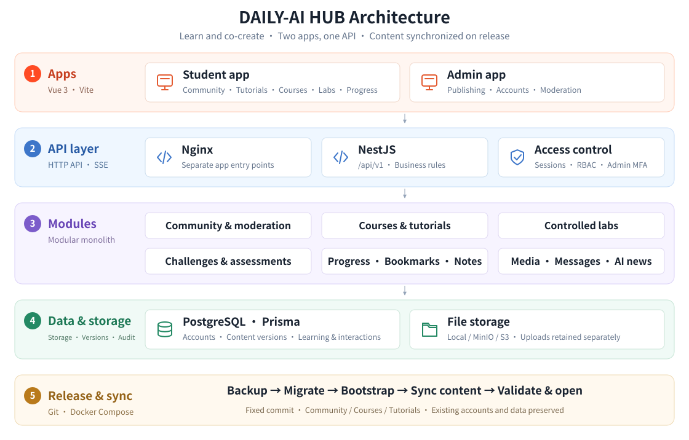

<p align="center">
  
</p>

<h1 align="center">DAILY-AI HUB</h1>

<p align="center">
  <a href="README.md" lang="zh-CN">简体中文</a> · <strong>English</strong>
</p>

<p align="center">
  <strong>An AI learning and practice community for university students</strong><br />
  Think beyond the box · Empower through interaction<br />
  Build skills through digital practice · Create the future together
</p>

<p align="center">
  <a href="docs/architecture.md"></a>
</p>

<p align="center">
  <a href="#overview">Overview</a> ·
  <a href="docs/architecture.md">Documentation (中文)</a> ·
  <a href="version.md">Changelog (中文)</a> ·
  <a href="#first-deployment-and-incremental-updates">Deployment</a> ·
  <a href="#development-and-checks">Development</a> ·
  <a href="#contributors">Contributors</a>
</p>

## Architecture

<p align="center">
  <a href="docs/architecture.md"></a>
</p>

<details>
<summary>Directories and technology stack</summary>

| Directory | Responsibility |
| --- | --- |
| `frontend/` | Vue 3 student app; real API by default, with separate Mock demo commands |
| `admin-web/` | Vue 3 + Element Plus admin app for content, accounts and community operations |
| `server/` | NestJS + Prisma for authentication, permissions, business data and files |
| `packages/` | Shared contracts, brand constants, course assets and separate test fixtures |
| `deploy/compose/` | Environment configuration, container orchestration and the unified release entry point |

</details>

## Overview

An AI learning and practice community for university students, covering discussions, tutorials, foundational courses, controlled labs, AI news, challenges and assessments, plus bookmarks, notes and learning progress. The admin app handles publishing, user management and community moderation.

Visitors can browse the landing page and public tutorial titles and covers. Community access, course learning, tutorial bodies, videos and attachments require sign-in. The landing page's five hero cards use static content and images.

Labs use allowlisted actions and do not execute arbitrary shell commands. Email, Tihe (题盒) and other external services require separate configuration and acceptance checks.

## Development and checks

Use Node.js 22. Run the following from the repository root; database integration and end-to-end tests also require an isolated environment.

```bash
node scripts/release.mjs install
node --test scripts/release.test.mjs
(cd server && npm ci && npm run check)
(cd admin-web && npm ci && npm run check)
(cd frontend && npm ci && VITE_DATA_MODE=api npm run check)
```

## Versioning and releases

[version.md](version.md) is the source of truth for the application version. Install the push checks above after cloning. Commit and merge changes into `main`, pass validation and ensure a clean working tree, then publish:

```bash
node scripts/release.mjs publish --summary "Summary of this release"
```

Each batch pushed to `main` increments the patch version once and atomically pushes the commits and version tag. Feature branch pushes, builds and repeated deployments do not increment it. Retry failed pushes with the same version; do not force-push or bypass hooks. Integrate any existing custom hooks first.

The student app, admin app and API must have matching build versions. Pin the Git commit with `APP_COMMIT_SHA`. Pages display their build version; `GET /api/v1/version` returns the version, commit and environment. Application and content package versions are maintained separately.

## First deployment and incremental updates

**Every first deployment and incremental update must synchronize all three official content collections below. Pulling GitHub code alone does not update the application database.**

| Community | Foundational courses | Tutorial center |
| --- | --- | --- |
| 100 posts · 200 replies · Images | 24 courses · 144 lessons · 72 images | 24 tutorials · Covers and media · Categories and public playlists |

Prepare the target environment and images built from a fixed commit using the [deployment configuration](deploy/compose/README.md), then run `bash deploy/compose/release.sh`: backup → migrate → `bootstrap` → synchronize all three content collections → validate → open services. The [content source, synchronization and troubleshooting guide](deploy/PROJECT_CONTENT.md) applies to campus, Feiniu and other servers.

Keep `LOAD_DEMO_DATA=false`; do not run Seed or import test accounts. Preserve existing accounts, manual configuration, business data, uploads and backups. A `protected` result means on-site content was preserved, not updated. Create the initial administrator through private environment configuration, and publish at least three learning tracks in the admin app before opening onboarding.

Further documentation (in Chinese):

- [Docker Compose quick deployment](docs/deployment/quick-deploy.md)
- [Architecture](docs/architecture.md)
- [Service deployment](docs/deployment/service-deployment.md)
- [API modules](docs/api/module-api.md)
- [Database schema](docs/database/schema.md)
- [Tutorial co-creation](docs/resource-co-creation.md)
- [Requirements coverage](docs/mapping/requirements-coverage.md)

## Contributors

<table>
  <tr>
    <td align="center">
      <a href="https://github.com/xiaoye1433223">
        <br />
        <sub><b>xiaoye1433223</b></sub>
      </a>
    </td>
    <td align="center">
      <a href="https://github.com/15759233">
        <br />
        <sub><b>15759233</b></sub>
      </a>
    </td>
    <td align="center">
      <a href="https://github.com/wangyun2006">
        <br />
        <sub><b>wangyun2006</b></sub>
      </a>
    </td>
  </tr>
  <tr>
    <td align="center">
      <a href="https://github.com/Zjw062315">
        <br />
        <sub><b>Zjw062315</b></sub>
      </a>
    </td>
    <td align="center">
      <a href="https://github.com/zhanglean76-gif">
        <br />
        <sub><b>zhanglean76-gif</b></sub>
      </a>
    </td>
    <td align="center">
      <a href="https://github.com/7nvv8hyfbn-eng">
        <br />
        <sub><b>7nvv8hyfbn-eng</b></sub>
      </a>
    </td>
  </tr>
</table>

## License

This project is licensed under the [MIT License](LICENSE).
