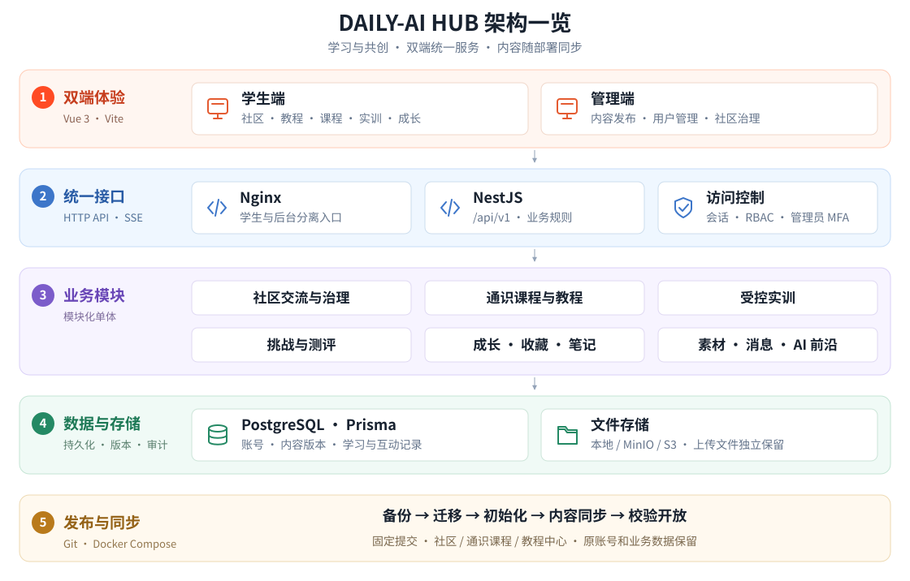

<p align="center">
  
</p>

<h1 align="center">DAILY-AI HUB</h1>

<p align="center">
  <strong>高校 AI 学习与实践社区</strong><br />
  破盒启智、交互赋能 数训筑基、共创未来
</p>

<p align="center">
  <a href="docs/architecture.md"></a>
</p>

<p align="center">
  <a href="#简介">项目简介</a> ·
  <a href="docs/architecture.md">项目文档</a> ·
  <a href="version.md">版本记录</a> ·
  <a href="#首次部署与增量更新">部署指南</a> ·
  <a href="#开发验证">开发验证</a> ·
  <a href="#作者">贡献者</a>
</p>

## 架构

<p align="center">
  <a href="docs/architecture.md"></a>
</p>

<details>
<summary>目录与技术栈</summary>

| 目录 | 职责 |
| --- | --- |
| `frontend/` | Vue 3 学生端，默认真实 API；Mock 使用独立演示命令 |
| `admin-web/` | Vue 3 + Element Plus 管理端，维护内容、账号与社区运营 |
| `server/` | NestJS + Prisma，统一认证、权限、业务数据与文件 |
| `packages/` | 共享契约、品牌常量、课程素材与独立测试夹具 |
| `deploy/compose/` | 环境配置、镜像编排与统一发布入口 |

</details>

## 简介

面向高校学生的 AI 学习与实践社区，包含社区交流、教程中心、通识课程、受控实训、AI 前沿、挑战与测评，以及收藏、笔记和成长记录。管理后台负责内容发布、用户管理与社区治理。

访客可浏览品牌落地页及教程中心的公开标题、封面；社区、课程学习、教程正文、视频和附件需登录。落地页首屏五张展示卡片使用固定内容与图片。

实训采用白名单动作，不执行任意 Shell。邮件、《题盒》等外部服务需单独配置和验收。

## 开发验证

使用 Node.js 22。以下命令在仓库根目录执行；数据库集成与端到端测试另需隔离环境。

```bash
node scripts/release.mjs install
node --test scripts/release.test.mjs
(cd server && npm ci && npm run check)
(cd admin-web && npm ci && npm run check)
(cd frontend && npm ci && VITE_DATA_MODE=api npm run check)
```

## 版本与发布

[version.md](version.md) 是应用版本依据。新克隆先安装上述推送检查；改动提交并合并到 `main`，工作树干净且校验通过后发布：

```bash
node scripts/release.mjs publish --summary "本批更新摘要"
```

每批 `main` 推送递增一次补丁号，并原子推送提交和版本标签；分支推送、构建及重复部署不递增。失败重试沿用本批版本，禁止强推或绕过钩子；已有自定义钩子需先整合。

三端构建版本须一致，使用 `APP_COMMIT_SHA` 固定提交。页面显示构建版本，`GET /api/v1/version` 返回版本、提交及环境；应用版本与内容包版本分别维护。

## 首次部署与增量更新

**首次部署和每次增量更新，都必须同步以下三类正式内容。仅拉取 GitHub 代码不等于已更新业务库。**

| 社区交流 | 通识基础 | 教程中心 |
| --- | --- | --- |
| 100 篇帖子 · 200 条回复 · 配图 | 24 门课程 · 144 节课时 · 72 张图片 | 24 条教程 · 封面与媒体 · 分类与公共播放列表 |

按[部署配置](deploy/compose/README.md)准备目标环境和固定提交的镜像，再执行 `bash deploy/compose/release.sh`：备份 → 迁移 → `bootstrap` → 三类内容同步 → 校验 → 开放服务。[内容来源、同步与排查](deploy/PROJECT_CONTENT.md)适用于校园、飞牛及其他服务器。

保持 `LOAD_DEMO_DATA=false`，不运行 Seed 或导入测试账号。保留原账号、人工配置、业务数据、上传文件及备份；报告中 `protected` 表示保留现场内容，不能当作已更新。初始管理员由环境私有配置创建，首次开放引导前须在后台发布至少三个学习方向。

其他说明：

- [Docker Compose 快速部署](docs/deployment/quick-deploy.md)
- [基本架构](docs/architecture.md)
- [服务部署方案](docs/deployment/service-deployment.md)
- [API 模块](docs/api/module-api.md)
- [数据库模型](docs/database/schema.md)
- [教程中心共创](docs/resource-co-creation.md)
- [需求覆盖矩阵](docs/mapping/requirements-coverage.md)

## 作者

<table>
  <tr>
    <td align="center">
      <a href="https://github.com/xiaoye1433223">
        <br />
        <sub><b>xiaoye1433223</b></sub>
      </a>
    </td>
    <td align="center">
      <a href="https://github.com/15759233">
        <br />
        <sub><b>15759233</b></sub>
      </a>
    </td>
    <td align="center">
      <a href="https://github.com/wangyun2006">
        <br />
        <sub><b>wangyun2006</b></sub>
      </a>
    </td>
  </tr>
  <tr>
    <td align="center">
      <a href="https://github.com/Zjw062315">
        <br />
        <sub><b>Zjw062315</b></sub>
      </a>
    </td>
    <td align="center">
      <a href="https://github.com/zhanglean76-gif">
        <br />
        <sub><b>zhanglean76-gif</b></sub>
      </a>
    </td>
    <td align="center">
      <a href="https://github.com/7nvv8hyfbn-eng">
        <br />
        <sub><b>7nvv8hyfbn-eng</b></sub>
      </a>
    </td>
  </tr>
</table>

## 许可

本项目采用 [MIT License](LICENSE)。
